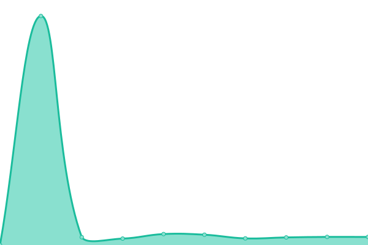
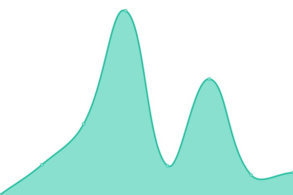
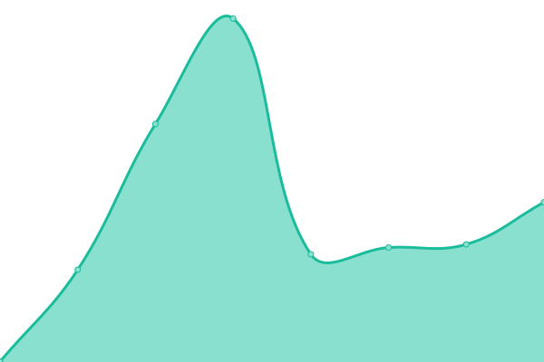

# [📈 Live Status](https://sonixapp.github.io): <!--live status--> **🟩 All systems operational**

This repository contains the open-source uptime monitor and status page for [Sonix](https://sonixapp.com), powered by [Upptime](https://github.com/upptime/upptime).

With [Upptime](https://upptime.js.org), you can get your own unlimited and free uptime monitor and status page, powered entirely by a GitHub repository. We use [Issues](https://github.com/sonixapp/sonixapp.github.io/issues) as incident reports, [Actions](https://github.com/sonixapp/sonixapp.github.io/actions) as uptime monitors, and [Pages](https://sonixapp.github.io) for the status page.

<!--start: status pages-->
<!-- This summary is generated by Upptime (https://github.com/upptime/upptime) -->
<!-- Do not edit this manually, your changes will be overwritten -->
<!-- prettier-ignore -->
| URL | Status | History | Response Time | Uptime |
| --- | ------ | ------- | ------------- | ------ |
|  [API](https://api.sonixapp.com/health) | 🟩 Up | [api.yml](https://github.com/sonixapp/sonixapp.github.io/commits/HEAD/history/api.yml) | 

 381ms
     
 | 

<a href="https://sonixapp.github.io/history/api">100.00%</a>
    

|  [Join](https://join.sonixapp.com) | 🟩 Up | [join.yml](https://github.com/sonixapp/sonixapp.github.io/commits/HEAD/history/join.yml) | 

 472ms
     
 | 

<a href="https://sonixapp.github.io/history/join">100.00%</a>
    

|  [Website](https://sonixapp.com) | 🟩 Up | [website.yml](https://github.com/sonixapp/sonixapp.github.io/commits/HEAD/history/website.yml) | 

 342ms
     
 | 

<a href="https://sonixapp.github.io/history/website">100.00%</a>
    

<!--end: status pages-->

[**Visit our status website →**](https://sonixapp.github.io)

## 📄 License

- Powered by: [Upptime](https://github.com/upptime/upptime)
- Code: [MIT](./LICENSE) © [Sonix](https://sonixapp.com)
- Data in the `./history` directory: [Open Database License](https://opendatacommons.org/licenses/odbl/1-0/)
